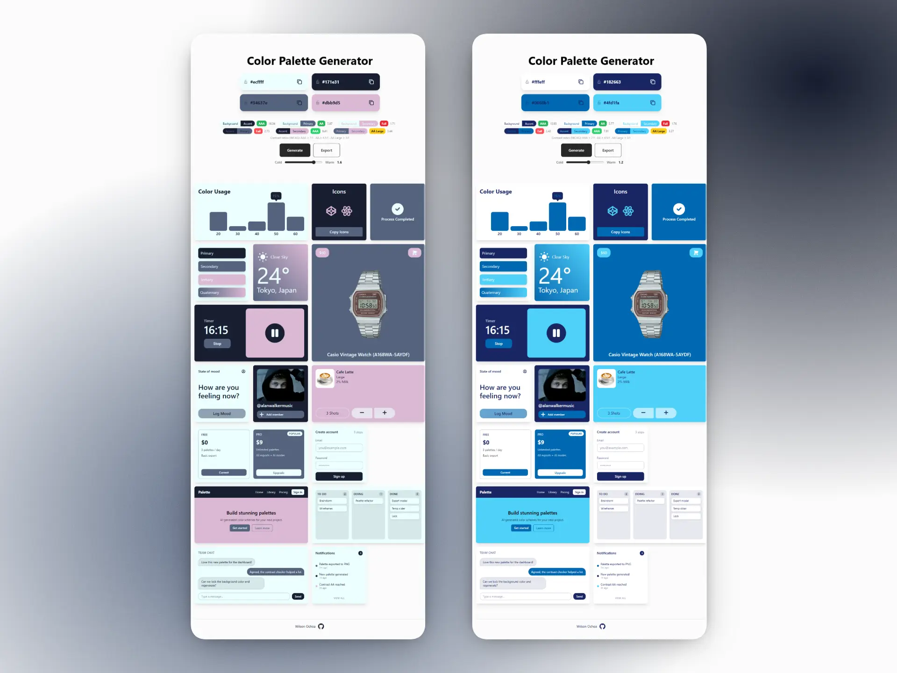

# Palette Lab

Color palette generator AI. Generates 4-color palettes and previews them instantly across a bento grid of real UI components — buttons, chat, kanban, pricing, forms, and more.



## Features

- AI-powered 4-color palettes via the Huemint API
- Live preview across 16 themed UI components
- Lock individual colors and regenerate the rest
- Cold / Warm temperature control
- WCAG contrast checker (AAA / AA / AA Large)
- Export as CSS variables, Tailwind config, JSON, or PNG
- Copy hex codes with one click
- Session persistence and smooth palette transitions

## Tech Stack

React 19 · TypeScript · Vite · Tailwind CSS v4

## Getting Started

```bash
pnpm install
pnpm dev
```

## Scripts

| Command        | Description                  |
| -------------- | ---------------------------- |
| `pnpm dev`     | Start the dev server         |
| `pnpm build`   | Typecheck + production build |
| `pnpm lint`    | Run oxlint                   |
| `pnpm preview` | Preview the production build |

## How it works

The app sends a generation specification to the Huemint transformer API. The result is mapped to four CSS custom properties (`--color-background`, `--color-accent`, `--color-primary`, `--color-secondary`), re-theming the whole page and the bento grid instantly. Locking colors, temperature, contrast checking, and export sit on top of that core loop.

## Author

[Wilson Ochoa](https://github.com/wilocdev/color-palette-generator)
